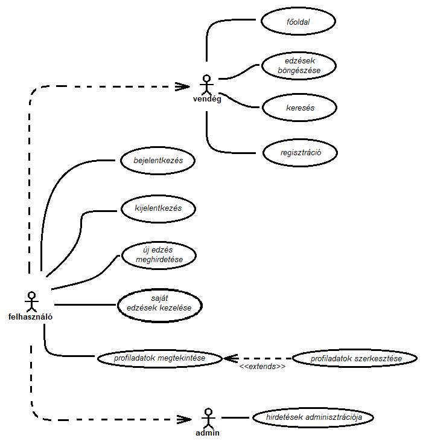

# TrainingScheduler

## 1. A projekt és a szoftver célja

Egy sportolói oldal létrehozása, ahol a felhasználók  (akik lehetnek edzők, vagy sportolók), edzéseket hirdethetnek meg, 
illetve jelentkezhetnek azokra.

## 2. Feladat elemzés

### Főbb Lapok és funkciójuk

1. Főoldal:
Leírás, a legközelebbi edzések megjelenítése.
2. Edzések:
A meghirdetett edzések listája (időpont, férőhelyek száma, még szabad férőhelyek száma), jelentkezés.
3. Saját edzések:
Edzések, melyekre jelentkezett a felhasználó / edzések amiket meghirdetett edzőként.
4. Bejelentkezés (nem bejelentkezett felhasználók számára):
E-mail, jelszó mező kitöltése után bejelentkezés a már regisztrált felhasználók számára.
5. Regisztráció:
E-mail cím, és jelszó megadása után lehet regisztrálni.
6. Saját profil:
Felhasználó profilja, adatok módosítása.

### Résztvevők

Három különböző eset:

1. Vendég (nem bejelentkezett felhasználó): csak böngészni tud az oldalon.
2. Bejelentkezett felhasználó: lehetősége van edzésekre jelentkezni, edzéseket meghirdetni.
3. Admin: elérhető számára az összes felhasználói funkció, bármely edzést törölheti, módosíthatja.

### Jelentkezés
Az edzők által meghirdetett edzésekre lehet jelentkezni, amennyiben még van szabad hely. 
Ha már nincs szabad hely, a felhasználó figyelést állíthat be az adott 
hirdetésre, így értesítést kap, ha felszabadul egy hely.
Ha nem érkezik minimális számú jelentkező az edzésre, annak időpontja előtt, a hirdetés automatikusan törlődik.
Ezt a minimális számot az edző határozza meg.

###Használati eset diagram

